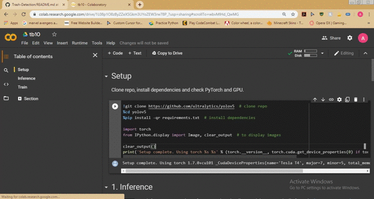

# Trash detection using Yolov5
## Overview
This model can be used to detect trash in streets that is generally being unknown to the Municipal Co-orperation and thus is not cleaned and creates unhgienic conditions. It will help the Municipal Co-orperation to know if a place is not clean and if a place is found to be not clean then that place can be cleaned by the Municipal Co-orperation.
## Requirements
1. Pytorch
2. Yolov5
## Usage
1. For usage, click on this colab notebook 
2. Upload the weight file into the colab notebook from this [link](https://www.dropbox.com/s/ndp10mk3wx2r262/last%282%29.pt?dl=0)
3. Put the weights in the yolov5 directory
4. Upload image and put it in the yolov5 directory as well
5. Run the detect cell.
## Demo

